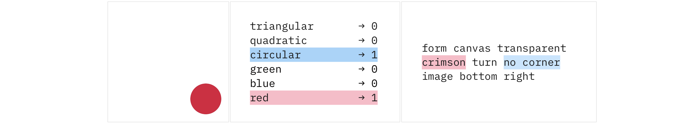

<div align="center" height="130px">
  <br/>
  <p></p>
</div>

> Primitive shapes to check how interpretable your latent representations are! 

## 🎯 Motivation

While quantifying interpretability of machine learning algorithm, we often need to compare the predicted latent representation with underlying factors of generative process. Thus, introducing a simple dataset that does not require domain knowledge yet possess ground truth attributes annotation might be beneficial for a hypotheses testing. 



For this reason and primarily for benchmarking we propose a synthetic dataset of primitive shapes. The image is a white canvas with random shape (i.e., square, triangle, circle) of random color (i.e., red, green, blue), and random size (i.e., small, medium, large). Caption is generated from visual parameters of a shape, its location, and words sampled from the vocabulary, using a hand-written grammar. The vector of attributes encodes shape and color, their combination represents a target class y.

## 📖 Citation

This dataset as a part of a research paper ["Cross-Modal Conceptualization in Bottleneck Models"](https://arxiv.org/abs/2310.14805) was introduced in EMNLP 2023. To cite it please use the following bibtex:
```bibtex
@inproceedings{
    alukaev2023crossmodal,
    title={Cross-Modal Conceptualization in Bottleneck Models},
    author={Danis Alukaev and Semen Kiselev and Ilya Pershin and Bulat Ibragimov and Vladimir V. Ivanov and Alexey Kornaev and Ivan Titov},
    booktitle={The 2023 Conference on Empirical Methods in Natural Language Processing},
    year={2023},
    url={https://openreview.net/forum?id=ghF1EB6APx}
}
```